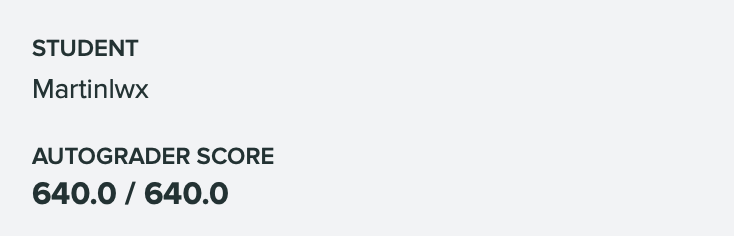

## Source

---

https://sp21.datastructur.es/materials/proj/proj1/proj1

## Comments

---

The entire project is worth 640 points.

-   `deque/LinkedListDeque`: 230 points
-   `deque/ArrayDeque`: 230 points
-   `deque/MaxArrayDeque`: 80 points
-   `gh2/GuitarString`: 80 points

And there are a total of 48 extra credit points available:

-   Full points on the checkpoint (16 points)
-   Making an autograder (32 points)

I would say it is not easy to get a full 640 points. We need to take care of everything. Some details:

-   redundant code are not allowed. Example: `public` keyword in the interface
-   I let `Deque` **implements** `Iterable<T>`, so I thought I don't need to repeat this in the `ArrayDeque` or `LinkedListDeque`. However, the autograder report a bug :(
-   `equals`: The test case may compare the `ArrayDeque` with `LinkedListDeque`

...

Finally, I did it 😄